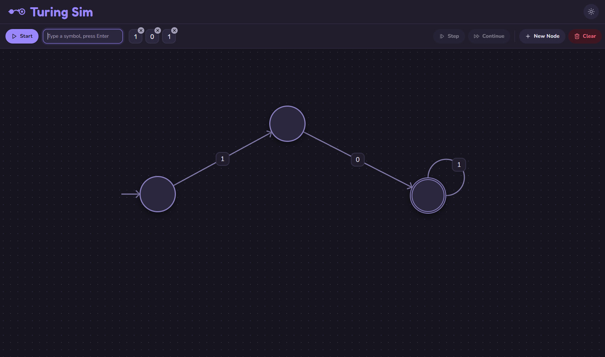

# Turing Sim

A sleek, interactive **finite-state machine builder and simulator** that runs in the browser. Design an automaton on a canvas — states, labeled transitions, a start state, and accept states — then feed it an input sequence and watch it run, step by step, lighting up as each symbol is consumed.

**▶ Live app: [turingsim.gevorkmanukyan.com](https://turingsim.gevorkmanukyan.com/)**



## Features

- **Visual builder** — add states on an infinite dotted canvas, draw labeled transitions between them (including self-loops), drag to arrange, and rename inline. A radial menu on each state keeps the controls close at hand.
- **Start & accept states** — mark a single start state and any number of accept states, with distinct styling.
- **Interactive input sequence** — build the input as draggable chips: type a symbol and press Enter to add one, drag to reorder, and click × to remove.
- **Step-through simulation** — run the whole string at once (**Start** / **Continue**) or advance one symbol at a time (**Step**). The active state and the input chips highlight as the machine consumes the input, ending in a clear **ACCEPTED** / **REJECTED** result.
- **Light & dark themes** — a polished, rounded design system with a persisted theme toggle.
- **Autosave** — your machine and input are saved to the browser (localStorage) and restored on reload.

## Tech stack

- **[React 18](https://react.dev/)** + **[TypeScript](https://www.typescriptlang.org/)**, bundled with **[Vite](https://vitejs.dev/)**
- **[Zustand](https://github.com/pmndrs/zustand)** for state management (with `persist` for localStorage)
- **[dnd-kit](https://dndkit.com/)** for canvas dragging and sortable input chips
- **SCSS** with a CSS-custom-property design-token system (light/dark theming)
- **[lucide-react](https://lucide.dev/)** icons and a hand-rolled SVG logo

## Getting started

Requires **Node.js 18+**.

```bash
# install dependencies
npm install

# start the dev server (http://localhost:5173)
npm run dev

# type-check + production build
npm run build

# preview the production build locally
npm run preview

# lint
npm run lint
```

## Usage

1. Click **Add a state** (or **New Node**) to create your first state, then use a state's radial menu to add transitions, connect new states, rename, or mark it as start/accept.
2. Label each transition with the symbol it consumes.
3. Build an input in the toolbar: type a symbol, press **Enter**, and reorder the chips as needed.
4. Press **Start** to run, **Step** to advance one symbol, or **Continue** to run to the end — and read the accept/reject result.

## Roadmap

Turing Sim currently models deterministic finite automata (DFA). The simulation engine is built behind a small interface so additional automaton types can be added without reworking the UI:

- NFA with ε-transitions
- Pushdown automata (stack)
- Mealy / Moore machines (output transducers)
- Turing machines (tape, head, read/write/move)

## License

Released under the [MIT License](LICENSE).
